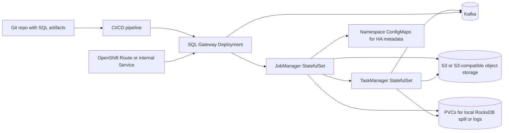

Flink jobs execute across both components, but they perform entirely different roles in the process. [1, 2, 3, 4] 
The split responsibilities between the two core [Apache Flink Architecture](https://nightlies.apache.org/flink/flink-docs-stable/docs/concepts/flink-architecture/) components work as follows: [5] 
## 1. JobManager: The Coordinator
The JobManager is the master node. It receives your JAR file, but it does not execute the actual data processing code inside your streams. Instead, it handles orchestration: [1, 6, 7, 8] 

* Parses your JAR's main() method to build the execution graph (the JobGraph).
* Coordinates central cluster actions like resource allocation, checkpoints, and recovery.
* In Application Mode, the JobManager explicitly runs the JAR's main() method locally to generate the graph without needing a heavy client. [1, 5, 9, 10, 11] 

## 2. TaskManager: The Worker
The TaskManagers are the worker nodes. They are where the heavy lifting and heavy processing of your data actually happen. [1, 12, 13, 14] 

* The JobManager breaks your JAR down into smaller, parallel tasks.
* These tasks are shipped to the TaskManagers, which execute them inside allocated memory slots (Task Slots).
* Your transformation logic (e.g., .map(), .flatMap(), custom window functions) executes directly inside the TaskManager JVMs. [1, 5, 12] 

## Summary Table

| Feature [1, 5, 9, 12, 15] | JobManager | TaskManager |
|---|---|---|
| Role | Master / Coordinator | Worker / Executor |
| What it runs | The coordination, optimizations, and scheduling logic | The actual user-defined functions and business logic |
| Memory usage | Low (manages metadata) | High (stores state backends like RocksDB, network buffers) |

If you are experiencing out-of-memory errors or performance bottlenecks tied to your data volume, your primary focus should be optimizing your TaskManager configurations. [1, 16] 
Are you currently troubleshooting a performance issue or configuring resource allocation for a specific deployment like Kubernetes or YARN? [10, 17] 

Yes, exactly. You do not need to run a standalone client to submit a Flink job. [1] 
You only need to compile your code into a compiled JAR file and send it directly to the Flink cluster. [2, 3] 
Here is exactly how the process works depending on the method you choose:
## Method 1: The Flink Web UI

   1. Open the Flink Web Dashboard in your browser.
   2. Click on Submit New Job in the left menu.
   3. Click Add New and upload your compiled JAR file.
   4. Click on the uploaded JAR, specify your entry class name (optional if defined in your manifest), and click Submit. [4, 5, 6, 7, 8] 

## Method 2: The Flink REST API
You can fully automate your deployments by using standard HTTP requests to communicate with the JobManager:

   1. Upload the JAR: Send a POST request to /jars/upload containing your multi-part form data (the JAR file). This returns a unique jarid.
   2. Run the Job: Send a POST request to /jars/<jarid>/run to instruct the cluster to start executing the job. [9, 10, 11, 12, 13] 

## What Happens Behind the Scenes
When you upload and run the JAR via the UI or REST API, the Flink JobManager automatically acts as the client. It executes your JAR's main() method internally to extract the execution graph, schedules the tasks, and immediately deploys them to the TaskManagers for heavy data processing. [14, 15, 16] 
Would you like the exact curl commands to automate this via the REST API, or are you looking to integrate this into a CI/CD deployment pipeline? [17] 

To integrate Apache Flink with Apache Kafka as a source and target, we must utilize Flink's modernized framework design. In Flink, architectural changes strictly enforce the Unified Source and Sink V2 APIs, which deprecated the legacy SourceFunction and SinkFunction interfaces completely. [1, 2] 
From an architectural standpoint, there are three primary design patterns available to accomplish this. [3, 4, 5] 
------------------------------
## Pattern 1: Programmatic Integration (DataStream API V2)
This is the most common pattern for core engineering teams building complex event-driven microservices, session windows, or highly customized data routing. [6] 
## Kafka as a Source
You must use the KafkaSource builder class. Under the hood, this relies on Flink’s split enumerator and reader architecture to distribute Kafka partitions across your TaskManager slots. [5, 7, 8] 

KafkaSource<String> source = KafkaSource.<String>builder()
    .setBootstrapServers("kafka-broker:9092")
    .setTopics("input-topic")
    .setGroupId("flink-consumer-group")
    .setStartingOffsets(OffsetsInitializer.latest())
    .setValueOnlyDeserializer(new SimpleStringSchema())
    .build();

DataStream<String> stream = env.fromSource(source, WatermarkStrategy.noWatermarks(), "Kafka Source");

## Kafka as a Target
To write data out, implement the standard unified KafkaSink. To achieve Exactly-Once delivery semantics, you must enable Two-Phase Commit (2PC), which ties Flink's checkpointing mechanism directly to Kafka transactions. [1, 5, 9, 10, 11] 

[KafkaSink](https://nightlies.apache.org/flink/flink-docs-release-1.14/api/java/org/apache/flink/connector/kafka/sink/KafkaSink.html)

<String> sink = KafkaSink.<String>builder()
    .setBootstrapServers("kafka-broker:9092")
    .setRecordSerializer(KafkaRecordSerializationSchema.builder()
        .setTopic("output-topic")
        .setValueSerializationSchema(new SimpleStringSchema())
        .build()
    )
    .setDeliveryGuarantee(DeliveryGuarantee.EXACTLY_ONCE) // Mandates 2PC / Checkpointing
    .setTransactionalIdPrefix("flink-kafka-sink")
    .build();

stream.sinkTo(sink);

------------------------------
## Pattern 2: Declarative Integration (Table API & Flink SQL)
For teams leaning heavily toward analytics or data platform abstractions, the declarative approach allows you to bind Kafka topics directly into virtual relational tables using SQL. Flink handles the boilerplate serialization and deserialization behind the scenes. [4, 5, 12] 
You execute a CREATE TABLE DDL statement using the official kafka connector identifier: [4, 13, 14] 

CREATE TABLE KafkaSourceTable (
  `user_id` STRING,
  `payload` STRING,
  `ts` TIMESTAMP(3) METADATA FROM 'timestamp' -- Captures Kafka Record Timestamp
) WITH (
  'connector' = 'kafka',
  'topic' = 'input-topic',
  'properties.bootstrap.servers' = 'kafka-broker:9092',
  'properties.group.id' = 'flink-sql-group',
  'scan.startup.mode' = 'latest-offset',
  'format' = 'json' -- Supports json, avro, protobuf, etc.
);

* 
* As a Source: Use a query like SELECT * FROM KafkaSourceTable.
* As a Target: Map a matching target table and run INSERT INTO KafkaTargetTable SELECT....
* 

------------------------------
## Pattern 3: Advanced Infrastructure Integration (Dynamic Kafka Source)
In highly mature platforms requiring multi-tenant setups or cloud migrations, running standard sources can lead to severe operational overhead because adding a new cluster requires a manual code rewrite and job deployment. [3, 15] 
The Dynamic Kafka Source acts as a meta-connector. [3] 

* 
* Instead of binding to a rigid bootstrap string or explicit topics, it polls a Kafka Metadata Service.
* When new Kafka clusters or dynamic topics are provisioned downstream, the metadata service flags them, and Flink automatically scales its active consumers to read from the new infrastructure without requiring a job restart. [3, 16, 17] 
* 

------------------------------
## Essential Dependencies (The Dependency Gotcha)
As an elite engineering principle, you must remember that streaming connectors are not bundled inside the binary distribution of the Flink runtime. You must explicitly bundle the necessary Maven dependencies directly into your fat application JAR before uploading it to the JobManager. [4, 7] 

<!-- Core DataStream Connector -->
<dependency>
    <groupId>org.apache.flink</groupId>
    <artifactId>flink-connector-kafka</artifactId>
    <version>${flink.kafka.version}</version>
</dependency>

## Production Checklist for Principal Engineers

   1. Checkpoint Tuning: If utilizing DeliveryGuarantee.EXACTLY_ONCE, ensure your transaction.max.timeout.ms on the Kafka side is configured strictly higher than Flink's maximum checkpoint timeout. If Flink holds a transaction open too long, Kafka will violently abort it. [18] 
   2. Watermark Alignment: When reading from highly imbalanced Kafka topics (where partition A receives 10x more traffic than partition B), make sure to configure WatermarkAlignment to pause the fast reader until the lagging partition catches up, preventing unnecessary state bloat. [16] 

Are you evaluating these patterns to solve a state-store bloat issue, or are you looking to architect an infrastructure migration using the Dynamic Kafka Source pattern? [3] 

A reference production architecture for Flink 2.3 + SQL Gateway + Kafka
A sample prod-grade source and sink DDL for Kafka with exactly-once settings
A comparison table: SQL Gateway vs Application JAR vs Kubernetes Operator

Updated todo list

For Flink 2.3, the common production patterns are not really about the `CREATE TABLE` itself. They are about how you package, submit, govern, and operate the SQL lifecycle around Kafka-backed tables.

The patterns I would treat as standard are:

1. `SQL Gateway` with versioned SQL artifacts
2. `Application JAR` that executes SQL through the Table API
3. `Platform-managed deployment` on Kubernetes or Yarn, usually wrapping one of the first two
4. `Interactive/manual submission` only for dev and incident response, not as the primary prod path

**Recommended Default**
For most production teams, the default should be `SQL Gateway + CI/CD + declarative SQL files`. That gives you a clean separation between runtime, governance, and deployment automation without forcing every SQL pipeline into a Java release cycle.

**1. SQL Gateway**
This is the most common production-facing way to submit Flink SQL when Kafka is both source and sink.

How it works:
- You run a long-lived Flink SQL Gateway service.
- Your deployment system submits `CREATE TABLE`, `INSERT INTO`, `STATEMENT SET`, and DML statements over REST.
- The gateway compiles and submits jobs to the Flink cluster.

Why teams use it:
- Clear operational boundary between SQL authors and cluster operators
- Easy CI/CD integration
- Better fit for multi-tenant data platform teams
- Central place for auth, auditing, quotas, catalogs, and session policy

When it is strongest:
- Many SQL pipelines
- Multiple environments
- Frequent schema/table evolution
- Need for a governed “data platform” interface

What I would standardize:
- All SQL in Git
- One deployment unit per pipeline
- Non-interactive REST submission from CI
- Environment-specific overlays for brokers, topics, checkpoints, state backend, and secrets
- Explicit connector and format versions aligned to the Flink 2.3 runtime

What not to do:
- Do not make humans paste SQL into ad hoc shells for prod changes
- Do not let teams independently manage connector jars per job unless you want version drift

**2. Application JAR using Table API / `executeSql()`**
This is the other major production pattern. You write a small Java or Scala application that creates a `StreamTableEnvironment` and runs your SQL DDL/DML programmatically.

How it works:
- Your application contains the SQL strings or loads them from files
- The app executes:
  - source table DDL
  - sink table DDL
  - `INSERT INTO ... SELECT ...`
- You package and deploy it as a normal Flink application job

Why teams use it:
- Strong release discipline
- Easier dependency control
- Easier secrets/config injection
- Easier to combine SQL with programmatic logic, UDFs, catalogs, metrics, side outputs, or custom bootstrap code

When it is strongest:
- SQL is only part of a larger application
- You need custom UDFs or hybrid DataStream + Table pipelines
- You want one deployable artifact with strict software engineering controls

Tradeoff:
- More engineering overhead than SQL Gateway
- Every SQL change usually becomes an application release unless you externalize the SQL

This is often the right answer for business-critical Kafka pipelines with tighter SDLC requirements.

**3. Kubernetes-native or Yarn-native platform deployment**
This is not a separate submission model so much as the operating model around one of the above.

In practice, teams usually do one of these:
- Run SQL Gateway on Kubernetes and submit through REST
- Run Application Mode jobs on Kubernetes using the Flink Kubernetes Operator
- Run Application Mode jobs on Yarn via automation

For Flink 2.3, if you are building a modern production platform, Kubernetes is usually the center of gravity.

What I would prefer:
- `Application Mode` for long-running production jobs
- Kubernetes Operator for lifecycle, upgrades, savepoints, rollback, health management
- SQL Gateway when the organization wants a shared SQL control plane
- Application JAR when the organization wants app-style ownership

**4. SQL Client / Web UI / manual shell**
These are common in real life, but they are not what I would bless as the primary production path.

Use them for:
- local testing
- staging validation
- incident triage
- one-off catalog inspection

Do not use them as the normal prod submission mechanism because:
- poor change control
- hard to audit
- easy to drift from Git
- difficult rollback discipline

**How Kafka changes the decision**
Kafka as both source and sink introduces operational requirements that matter more than the submission method itself.

For source tables, I would require:
- explicit consumer group id
- explicit startup semantics
- schema contract owned outside the SQL file
- watermark strategy if event time matters
- dead-letter strategy for malformed records

For sink tables, I would require:
- explicit delivery guarantee
- key/value format strategy
- topic compaction and retention aligned to use case
- sink idempotency or transactional semantics
- partitioning behavior understood, not accidental

For example, for a Kafka sink in SQL, production DDL typically needs settings along the lines of:
- `'sink.delivery-guarantee' = 'exactly-once'`
- `'sink.transactional-id-prefix' = '...something stable...'`

And if the sink is keyed/upsert style, I would usually prefer `upsert-kafka` over plain `kafka` where the semantics fit, because the contract is clearer for changelog streams.

**Principal-engineer recommendation by use case**

Use `SQL Gateway` when:
- the job is primarily declarative SQL
- you want platform-level governance
- multiple teams author pipelines
- you want deployment via REST and CI/CD

Use `Application JAR` when:
- the job is strategic and business critical
- you need UDFs, custom bootstrap, or mixed APIs
- you want stronger artifact immutability
- you need tighter dependency and rollout control

Use `Kubernetes Operator + Application Mode` as the runtime pattern when:
- you operate many long-running jobs
- you care about savepointed upgrades and rollback discipline
- you want GitOps-style lifecycle management

Avoid `manual SQL Client submission` as the main prod pattern when:
- the pipeline matters
- compliance or auditability matters
- multiple operators are involved

**My production bias for Flink 2.3**
If I were standardizing an enterprise platform on Flink 2.3 today:

- Default platform path: `SQL Gateway on Kubernetes`
- Default deployment path: `CI/CD submits versioned SQL bundles through REST`
- Default runtime controls: checkpoints, savepoints, HA metadata, externalized state, alerting, autoscaling policy if validated
- Default Kafka posture: schema registry, explicit key/value formats, exactly-once only where the end-to-end business case justifies the cost
- Exception path: `Application JAR` for jobs with UDF-heavy logic, hybrid APIs, or stricter software release controls

**What I would explicitly ban**
- Web UI as the main prod deployment mechanism
- connector/version mismatch between cluster and job artifacts
- unversioned SQL pasted manually into prod
- implicit topic schemas with no registry or contract
- exactly-once claims without validating checkpoint cadence, Kafka transaction timeout, restart behavior, and sink semantics

**Short answer**
The most common production ways are `SQL Gateway`, `Application JAR with Table API SQL`, and `Kubernetes/Yarn automation` around those. For a principal-engineer-grade Flink 2.3 setup, I would treat `SQL Gateway + CI/CD` as the default for SQL-first Kafka pipelines, and use `Application JAR` when the pipeline needs stronger engineering control or hybrid logic.

If you want, I can give you one of these next:

1. A reference production architecture for `Flink 2.3 + SQL Gateway + Kafka`
2. A sample prod-grade source and sink DDL for Kafka with exactly-once settings
3. A comparison table: `SQL Gateway vs Application JAR vs Kubernetes Operator`

flowchart LR
    Dev[Git repo with SQL artifacts] --> CI[CI/CD pipeline]
    CI --> GW[SQL Gateway Deployment]
    GW --> JM[JobManager StatefulSet]
    JM --> TM[TaskManager StatefulSet]
    TM --> KAFKA[(Kafka)]
    GW --> KAFKA
    JM --> S3[(S3 or S3-compatible object storage)]
    TM --> S3
    JM --> CM[Namespace ConfigMaps for HA metadata]
    JM --> PVC[(PVCs for local RocksDB spill or logs)]
    TM --> PVC
    OPS[OpenShift Route or internal Service] --> GW\\Updated todo list

For a single-team, single-namespace OpenShift deployment with no operator, no cluster-admin privileges, and a namespace-scoped service identity, I would standardize on a small standalone Flink platform: one SQL Gateway, one JobManager, and a TaskManager pool, all isolated to one namespace and submitted through CI/CD over internal HTTP. Kafka stays external to the namespace. State is persisted to object storage, not to pod disks, and the service account only gets namespace-local permissions.

**Reference Topology**

**What I would deploy**

1. `sql-gateway`
   - `Deployment`, 2 replicas if you want control-plane availability.
   - Exposed via ClusterIP service, optionally an OpenShift Route if CI/CD or analysts need ingress.
   - Stateless. No PVC required.
   - Authn is usually done at the Route or network layer, not inside Flink.

2. `jobmanager`
   - `StatefulSet`, 1 replica for simplicity.
   - Stable DNS name helps with predictable internal endpoints.
   - Uses namespace-scoped HA via Kubernetes ConfigMaps if you want failover behavior.
   - Small PVC only if you want local log persistence; state should not live here.

3. `taskmanager`
   - `StatefulSet`, N replicas.
   - This is the right place to use StatefulSets because stable pod identity plus per-pod PVCs work well if you use RocksDB or ForSt local state directories.
   - Each replica gets its own PVC for local state backend files, spill, and faster restart warmup.

4. `config`
   - `ConfigMaps` for `flink-conf.yaml`, `log4j`, SQL defaults, catalogs if static.
   - `Secrets` for Kafka SASL/TLS credentials, object-store access keys, truststores, keystores.

5. `state backend`
   - S3, MinIO, Ceph RGW, or another S3-compatible object store.
   - Checkpoints and savepoints go there.
   - Do not design around PV-only checkpoints for prod recovery.

6. `kafka`
   - Usually external to the namespace: managed Kafka, shared cluster, or a platform namespace.
   - Your Flink namespace only needs egress, DNS, and credentials.

**OpenShift-specific constraints I would assume**
Without admin privileges, design for the default restricted security posture:

- Non-root containers only.
- Arbitrary UID support.
- No privileged SCC.
- No host networking.
- No NodePort or LoadBalancer assumptions unless the platform team already allows them.
- Only namespace-scoped `Role` and `RoleBinding`.
- No operator CRDs, no cluster-scoped RBAC, no mutating privileged workloads.

That means your image must already be OpenShift-compatible:
- writable directories owned by group 0 or broadly writable where needed
- no hardcoded user IDs
- no need for root at startup
- certs and configs mounted from secrets/configmaps

**Service identity and RBAC**
Use one namespace-scoped service account, for example `flink-runner`, bound only to the namespace.

Minimum practical permissions:
- `get`, `list`, `watch`, `create`, `update`, `patch` on `configmaps` if you use Kubernetes HA services
- `get`, `list`, `watch` on `pods` and `services` for service discovery and diagnostics
- `create` on `events` is helpful but optional
- `get` on `secrets` only if mounted secrets are not enough and something must read them dynamically

I would avoid giving Flink broad rights to create arbitrary workloads. In this model, CI/CD applies manifests; Flink runs jobs. Flink does not need to be a namespace orchestrator.

**Recommended deployment model**
Use a long-lived session-style control plane:

- SQL Gateway is always running.
- JobManager is always running.
- TaskManagers are always running at a baseline capacity.
- CI/CD submits versioned SQL statements or bundles to the SQL Gateway REST API.
- The submitted SQL creates source tables on Kafka, sink tables on Kafka, and starts long-running `INSERT INTO` jobs.

Why this model fits your constraints:
- no operator required
- no cluster-wide control plane
- stable and simple namespace footprint
- easy to secure with one service account and one route
- works well for one namespace and one team

**StatefulSet guidance**
If you want everything expressed as StatefulSets because the platform standard prefers it, that is workable, but I would still be selective.

My recommendation:
- `sql-gateway`: `Deployment`
- `jobmanager`: `StatefulSet`
- `taskmanager`: `StatefulSet`

Reason:
- SQL Gateway is stateless and horizontally replaceable.
- JobManager benefits from stable identity.
- TaskManagers benefit from stable identity and per-pod storage.

If your platform insists on StatefulSets only, it will still work, but it is not the cleanest fit for the gateway.

**Data-path architecture**
For Kafka source and sink in production, I would standardize these semantics:

Source side:
- explicit consumer group ID per pipeline
- explicit startup mode
- schema contract through JSON Schema, Avro, or Protobuf, preferably with registry
- event-time and watermarking designed intentionally, not omitted by accident
- poison-message strategy defined up front

Sink side:
- choose `kafka` vs `upsert-kafka` based on stream semantics
- use exactly-once only where business semantics require it
- define partitioning and key format explicitly
- define retention and compaction expectations with the Kafka team

For a SQL-first platform, most business pipelines should be one of:
- append stream to append topic via `kafka`
- changelog/upsert stream to compacted topic via `upsert-kafka`

**Availability and recovery**
For one namespace without operators, keep HA realistic.

What I would enable:
- checkpointing to object storage
- savepoints to object storage
- Kubernetes HA metadata store using ConfigMaps
- restart strategy with bounded failure rate
- externalized checkpoints retained on cancellation for controlled rollback

What I would not over-promise:
- multi-zone active/active sophistication
- autoscaling magic without careful testing
- full control-plane HA if the namespace has quota pressure or storage instability

If this is genuinely critical production, the object store and Kafka availability matter more than whether the JobManager is in a StatefulSet or Deployment.

**Network and security posture**
I would lock the namespace down like this:

- Default deny ingress and egress via NetworkPolicy.
- Allow egress only to:
  - Kafka brokers
  - schema registry if used
  - object storage endpoint
  - DNS
  - internal OpenShift API if using K8s HA services
- Expose only SQL Gateway, and only if required.
- Keep JobManager and TaskManagers internal-only.
- Use TLS to Kafka.
- Mount Kafka truststores and client credentials from Secrets.
- Use a Route with edge or re-encrypt termination if external submission is needed.
- Prefer CI/CD calling the SQL Gateway over humans using the UI.

**Storage**
Use two storage layers:

1. Durable state:
- S3-compatible object store for checkpoints and savepoints

2. Local working state:
- PVC per TaskManager pod for RocksDB or spill directories

Do not confuse these roles:
- PVC improves performance and restart behavior
- object storage is the recovery source of truth

**Resource shape**
For a one-namespace deployment, I would start with conservative, explicit sizing:

- SQL Gateway:
  - 0.5 to 1 vCPU
  - 1 to 2 GiB RAM
- JobManager:
  - 1 to 2 vCPU
  - 2 to 4 GiB RAM
- TaskManager:
  - 2 to 4 vCPU each
  - 8 to 16 GiB RAM each
  - 1 to 4 task slots each depending on workload shape
  - PVC sized for state and spill, often 20 to 100+ GiB depending on state size

The real tuning knob is TaskManager memory layout and slot count, not the control plane.

**How I would operate submissions**
I would not let engineers hand-submit prod SQL from the shell.

I would standardize this flow:
1. SQL artifacts live in Git.
2. CI lints and validates templates.
3. CI injects environment-specific values.
4. CI opens a SQL Gateway session or uses a stateless submission pattern.
5. CI submits:
   - `CREATE TABLE` source
   - `CREATE TABLE` sink
   - `INSERT INTO ... SELECT ...`
6. CI records returned operation handles and job IDs.
7. Rollback uses savepoints plus a previous SQL artifact version.

This gives you auditability and makes the namespace manageable without an operator.

**What I would standardize in manifests**
You asked for a principal-engineer reference architecture, so I would define these as mandatory platform conventions:

- one namespace per environment, not shared prod and non-prod
- one service account per Flink platform instance
- one object-store bucket/prefix per environment
- one config bundle for Flink defaults
- one secret bundle for Kafka and object storage credentials
- one baseline NetworkPolicy set
- one Route only for SQL Gateway if needed
- one CI/CD contract for SQL deployment and rollback
- one logging and metrics path into the platform observability stack

**What I would avoid**
- manual prod SQL via Web UI or CLI
- local PVs as the only checkpoint store
- running as root to bypass OpenShift restrictions
- broad service-account permissions
- mixing many unrelated pipelines into one uncontrolled gateway with no quotas
- exactly-once sinks without validating checkpoint duration, Kafka transaction timeouts, and restart behavior
- letting connector jars drift independently across pods

**My opinionated reference choice**
For your constraints, this is the cleanest production shape:

- OpenShift namespace-scoped deployment
- SQL Gateway as `Deployment`
- JobManager as `StatefulSet`
- TaskManagers as `StatefulSet`
- namespace-scoped service account and RBAC only
- Kafka external, secured with TLS and SASL if required
- checkpoints/savepoints in S3-compatible object storage
- CI/CD submits versioned SQL to SQL Gateway
- Route only for SQL Gateway, everything else internal
- no operators, no cluster-admin dependencies

If you want, I can take this one step further and give you one of these:

1. A concrete OpenShift manifest set for `SQL Gateway + JobManager + TaskManager + ServiceAccount + Role + Route`
2. A prod-grade `flink-conf.yaml` for this namespace-scoped model
3. A sample Kafka source/sink SQL bundle for Flink 2.3 with exactly-once and OpenShift-friendly secret handling